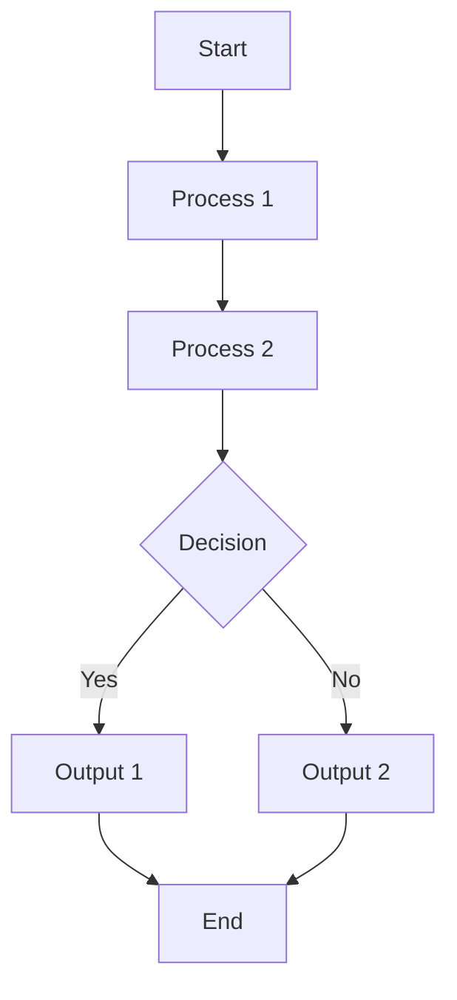
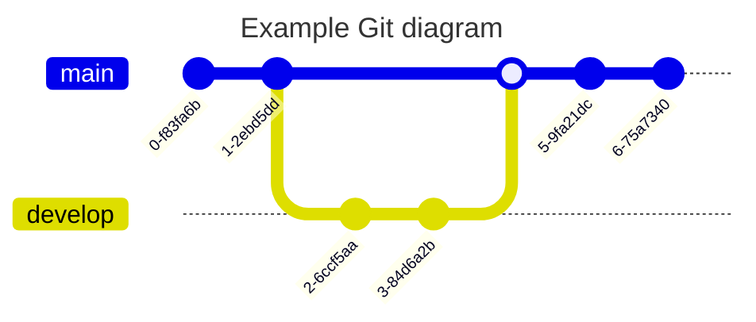

%% [Cover-img:: ![[Cloudflare tunnels_image_3.png]]] %%

```dataview
TABLE 
file.folder as "Folder", dateformat(date-modified,"MMM d, yyyy") as "Modified" 
FROM "meta"
SORT date-modified DESC 
WHERE file.name != this.file.name AND file.name != "index" AND draft != "true"
```

```/hello/ /pog/ {2}
hello 
pogwlkdd9
Word highlighting in code
```

> [!web] From the web
> lorem ibsumb

admononono

Admonition

‼‼ shaking ‼‼

🌊🌊 hey wave 🌊🌊 hey [^ocean-footnote]

💫💫spinner💫💫

🌈🌈ranbow🌈🌈

<kbd>alt</kbd> <kbd>DEL</kbd> 

> [!tree] hehehe
> treehehe

> [!music]
> kick rocks
> 
> eat fish

Check out [[Permalinks tracker|all the permalinks]]

[Welcome to Quartz 4](https://quartz.jzhao.xyz/) 

[The Eilleen Post \| Eilleen's Blog](https://blog.eilleeenz.com/) 

[\[2002.00042\] Gravitational Lensing in Rotating and Twisting Universes](https://arxiv.org/abs/2002.00042)

I am a big Perplexity user. perplexity, pplx, et cetera. [[Password on Quartz via client encryption with Staticrypt]] 

The shocking twist in the story is that 🤫🤫the `main character` is actually a robot.🤫🤫

🤫🤫Another twist [[All files chronologically modified]] 🤫🤫 and spoiler

A totally broken link [[like this]] or another thing where it's to a heading that does not exist [[Quartz customization log#bbbb]] or something that does work [[Quartz Snippets#Ways to browse plugins]]

Mermaid diagram



[GitGraph Diagrams | Mermaid](https://mermaid.js.org/syntax/gitgraph.html)



## Spotify thing 

Guide btw: [[ACTUAL guide to a now playing widget]]

A regular markdown embed: 


An image with the src pulled in

```

```


Telescoping text example: 

```telescopic
* lately I am
* reading not a lot of [[book club/|books]],
	* going to functions,
	    * going on short runs,
	    * building [[semiconductors and chips/]],
            * thinking about the type of person I want to become,
	* eating cheese.
		* listening to music
```

Original text:

```
* lately I am
* reading not a lot of [[book club/|books]],
	* going to functions,
	    * going on short runs,
	    * building [[semiconductors and chips/]],
            * thinking about the type of person I want to become,
	* eating cheese.
		* listening to music
```

[transforming text playground](https://poems.verses.xyz/test) [🔭 Telescopic Text | telescopic-text](https://jackyzha0.github.io/telescopic-text/) 

## table-a contents

> NOTE: This is a note too

## tabla contents 2

gggg

Thanks!!! 

- [feat(fancytext): added fancytext transformer that adds custom effect … · Naraenda/quartz-ascone@6c094df · GitHub](https://github.com/Naraenda/quartz-ascone/commit/6c094df3ac0863d0f13690ca2136ad894943e76e) 
- [feat: add transformer to add dragable sticky notes (no css) · Naraenda/quartz-ascone@d993faf · GitHub](https://github.com/Naraenda/quartz-ascone/commit/d993fafcbd0062458f3ae6158d607e4f513303d5#diff-e33cf52a1b4b3bcac8da550631137d55d2f4bad2914fc22b04cf249e5b2f296d) 
- As of august 2024 it was on an MIT license ([see here](https://github.com/Naraenda/quartz-ascone/blob/v4-ascone/LICENSE.txt))

> NOTE: This is a note

Sometimes we have footnoes so this needs to be long enough

[^ocean-footnote]: The world is big but simultaneously small. the ocean is unexplored for the most part. convinced there's some dinosaurs there. 

![[Quartz Cheatsheet#For copy-pasting]]

## lorem ipsummm

Thanks chatgpt!

Lorem ipsum dolor sit amet, shadows weave through the twilight, whispers of the unknown. Consectetur enigmatic dreams, veiled in midnight's embrace. A labyrinth of secrets, where echoes linger in the silence. Adipiscing elit, through the fog of uncertainty, dark silhouettes emerge, and the unknown beckons.

<iframe
  id="inlineFrameExample"
  title="Inline Frame Example"
  width="600"
  height="400"
  src="https://blog.eilleeenz.com/2025/2025-01-19">
</iframe>

skee yee


[^waterbottle]: wee woooooo
[^1]: sksksksksks lol
[^sjshsh]: text